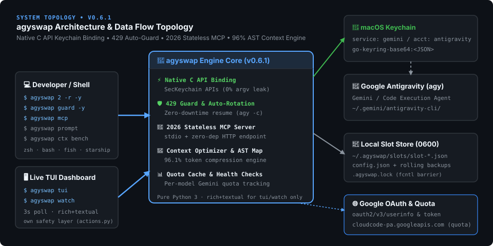

<p align="center">
  <a href="https://github.com/g1mn/agyswap">
    
  </a>
</p>

<p align="center">
  <a href="https://github.com/g1mn/agyswap/actions/workflows/ci.yml"></a>
  <a href="https://github.com/g1mn/agyswap/releases"></a>
  <a href="LICENSE"></a>
  <a href="#-requirements"></a>
  <a href="#-installation"></a>
  <a href="#-key-features"></a>
</p>

<p align="center">
  <b>Seamless Multi-Account &amp; Session Manager for Google Antigravity (<code>agy</code>) CLI</b><br>
  Run different accounts per terminal window simultaneously. Switch, rotate tokens, and resume sessions in one command — no browser, no popups, no lost context.
</p>

---

## 🏛️ Architecture Overview

`agyswap` acts as a zero-overhead local credential coordinator between your shell, macOS Keychain, and isolated local storage:

<p align="center">
  
</p>

### 🌐 Interactive Architecture Dashboard
For a live, interactive visualization of account slots, switching sequences, and storage layouts:
- **1-Click CLI Open**: Run `agyswap viz --open` to view your local account status in your default browser (saved in isolated `~/.agy-swap/dashboard.html` with Mode `0600`, completely git-clean).
- **Online Demo**: Hosted on GitHub Pages at [https://g1mn.github.io/agyswap](https://g1mn.github.io/agyswap).

---

## ✨ Key Features

- ⚡ **Instant Switching**: Switch active credentials in ~0.1s (`agyswap 2` or `agyswap switch work`).
- 🪟 **Per-Session Account Isolation**: Existing `agy` sessions keep their own account in memory; only new sessions inherit the switched profile — enabling true parallel multi-account workflows.
- 🚀 **One-Command Session Resume (`-r`)**: `agyswap 2 -r` switches account and immediately relaunches `agy -c` preserving 100% conversation history and context.
- ⚡ **Zero-Interaction Token Rotation**: `agyswap rotate --all` refreshes all OAuth tokens in the background — no browser required.
- 🔐 **Native OS Security (CWE-214 Mitigation)**: Direct binding to macOS `Security.framework` C API prevents OAuth secrets from appearing in process arguments (`argv` / `ps aux`).
- 🔒 **Atomic Concurrency & Strict Permissions**: Protected by `fcntl.flock` exclusive process locks, umask-safe creation (`0600`), and owner-only directories (`0700`).
- 🚨 **Expired Token Guard**: Prevents accidental switches to expired tokens unless explicitly forced with `--force`.
- ⚠️ **30-Minute Expiry Warnings**: Proactively highlights expiring credentials with `⚠️ Soon`.
- 🔍 **`health` Dashboard**: Instant summary of token validities, relative expiration times, and slot mappings.
- 🛡️ **`audit` Command**: Verifies and auto-corrects filesystem permissions across all credential stores.
- 🏷️ **Account Aliases**: Assign meaningful aliases (`main`, `work`, `dev`) for fast switching.
- 📦 **Backup & Migration (`export`/`import`)**: Migrate slot configurations across machines (live secrets excluded).
- 🎯 **`--dry-run` Previews**: Non-destructive preview mode for `switch`, `remove`, and `sync`.
- 🔔 **Active Session Detection**: Scans and warns about running `agy` sessions and their working directories.
- ⌨️ **Shell Auto-Completion**: Tab completion scripts for `bash`, `zsh`, and `fish`.
- 📦 **Zero External Dependencies**: Powered entirely by the Python 3 standard library.

---

## 🔄 How agyswap Differs from cswap

If you've used `cswap` for Claude Code, `agyswap` works differently due to how `agy` manages OAuth tokens — and this is actually a **feature**, not a limitation:

| | cswap (Claude Code) | agyswap (Antigravity) |
|:---|:---|:---|
| **Auth model** | Stateless (reads file on each request) | Stateful (token loaded into process memory at launch) |
| **Switch scope** | All sessions switch immediately | **Existing sessions keep their account; only new sessions use the switched profile** ✨ |
| **Parallel accounts** | One account at a time | **Run different accounts per terminal window simultaneously** ✨ |
| **Context on switch** | Session continues | Use `-r` to resume with 100% conversation history preserved |
| **Token refresh** | N/A | `rotate --all` → background OAuth refresh, no browser needed |

> 💡 **Pro tip**: Because each `agy` session independently holds its token in process memory, you can have Terminal A running `work@company.com` and Terminal B running `personal@gmail.com` **at the same time**, completely independently.

---

## 💡 Parallel Account Workflow

```bash
# Terminal A — work project
agyswap switch work    # switch Keychain to work@company.com
agy                    # → starts as work@company.com

# Terminal B — simultaneously, independent account
agyswap 1 -n           # switch Keychain to personal@gmail.com + auto-launch fresh agy session
                       # Terminal A is unaffected — still running as work@company.com ✨
```

---

## 🚀 Installation

### Option 1: Homebrew (Recommended on macOS)
```bash
brew install g1mn/tap/agyswap
# or
brew tap g1mn/tap && brew install agyswap
```
*Shell completions for `zsh`, `bash`, and `fish` are automatically configured by Homebrew.*

### Option 2: One-Line Curl Installer
```bash
curl -fsSL https://raw.githubusercontent.com/g1mn/agyswap/main/install.sh | bash
```

### Option 3: Pip / Pipx
```bash
pip install agyswap
# or
pipx install agyswap
```

### Option 4: Clone and Install
```bash
git clone https://github.com/g1mn/agyswap.git
cd agyswap
./install.sh
```

### Shell Auto-Completion (Optional)
```bash
# zsh (~/.zshrc)
echo 'eval "$(agyswap completion zsh)"' >> ~/.zshrc && source ~/.zshrc

# bash (~/.bashrc)
echo 'eval "$(agyswap completion bash)"' >> ~/.bashrc && source ~/.bashrc

# fish
agyswap completion fish > ~/.config/fish/completions/agyswap.fish
```

---

## 📖 Command Reference

### 1. Register Accounts
Log in via `agy` in your terminal, then register the active profile:
```bash
agy                   # Log in with first Google account in browser
agyswap add personal  # Save as slot #1 with alias 'personal'

agy                   # Log in with second Google account
agyswap add work      # Save as slot #2 with alias 'work'
```

### 2. List Profiles (`list` / default)
```bash
agyswap
# or
agyswap list
```
```text
Accounts:
  1: personal@example.com [personal] (active)
     ├ Token:  Valid   expires 15:30   in 5h 45m
     ├ Method: consumer
     └ Status: Active · just now · synced just now

  2: work@company.com [work]
     ├ Token:  Valid   expires 18:00   in 8h 15m
     ├ Method: consumer
     └ Status: Ready · 1h ago · synced 1h ago

Running instances:
  ● CLI   ~/projects/backend  (1 session)
```

### 3. Switch Profile (`switch` / slot shortcut)
```bash
agyswap 2                  # Quick switch (next agy launch uses slot #2)
agyswap 2 -r               # Switch + immediately resume last session (agy -c)
agyswap 2 -n               # Switch + launch a fresh agy session
agyswap 2 -r -y            # Switch + resume + auto-approve all tool permissions
agyswap 2 -n -y            # Switch + new session + auto-approve all tool permissions
agyswap switch work        # Switch by alias
agyswap switch user@gmail  # Switch by email
agyswap switch 1 --force   # Force switch with expired token
agyswap switch 2 --dry-run # Preview switch without applying
agyswap switch work --resume --dangerously-skip-permissions  # Long form
```

> **`-y` / `--dangerously-skip-permissions`**: Passes `--dangerously-skip-permissions` to `agy` when combined with `-r` or `-n`. Enables fully automated no-prompt workflows where `agy` auto-approves all tool permission requests.

### 4. Inspect Active Status (`status` / `whoami`)
```bash
agyswap status   # Show active slot and Keychain token info
agyswap whoami   # Query Google UserInfo API in real time
```

### 5. Token Health & Rotation (`health` / `rotate`)
```bash
agyswap health             # Token expiry dashboard for all slots
agyswap rotate --all       # Refresh all OAuth tokens (no browser, ~1s)
agyswap rotate 2           # Refresh specific slot
```
```text
🔍 agyswap health check

  ✅ Valid    #1  [personal] personal@example.com   ◀ active
             expires 15:30  (in 5h 45m)

  ❌ Expired  #2  [work]     work@company.com
             expired 2h ago
    → Run 'agyswap rotate 2' or re-login with agy
```

### 6. Security Audit (`audit`)
```bash
agyswap audit
```
```text
🛡️  agyswap Security Audit

  ✓ ~/.agy-swap       : Permission 0700 (Secure)
  ✓ ~/.agy-swap/slots : Permission 0700 (Secure)
  ✓ config.json       : Permission 0600 (Secure)
  ✓ macOS Keychain Interface : Connected (Native C API)

🎉 Security Audit Passed: All credential stores are isolated.
```

### 7. Backup & Migration (`export` / `import`)
```bash
# Export metadata (secrets excluded)
agyswap export ~/Desktop/agyswap-backup.json

# Restore on a new machine
agyswap import ~/Desktop/agyswap-backup.json
# Then log into each account once via 'agy' and run 'agyswap sync'
```

---

## 🔒 Security Model

| Security Layer | Implementation | Threat Mitigated |
| :--- | :--- | :--- |
| **Keychain Binding** | macOS `Security.framework` Native C API (`ctypes`) | Process argument sniffing (`ps aux`, CWE-214) |
| **Keychain ACL Reset** | Delete + re-create with `-A`/`-T` flags on every switch | macOS `securityd` password/certificate popup dialogs |
| **Storage Isolation** | Files `0600`, Directories `0700` (`opener=secure_opener`) | Cross-user / local process snooping & Umask race conditions |
| **Concurrency Control** | `fcntl.flock` exclusive file locking | Lost updates during simultaneous terminal operations |
| **Data Integrity** | Atomic replacement (`tmp -> replace`) + `backup/` history | File corruption on crash or abrupt power cut |
| **Web Dashboard** | `safe_json_for_script` Unicode escaping | Stored XSS inside HTML `<script>` tags |

---

## 📂 Storage Layout

```text
~/.agy-swap/                     # Mode 0700 (Owner rwx only)
├── config.json                  # Mode 0600 (Metadata & active slot mapping)
├── .agyswap.lock                # Mode 0600 (flock concurrency barrier)
├── slots/                       # Mode 0700 (Directory)
│   ├── slot-1.json              # Mode 0600 (Token credential payload)
│   └── slot-2.json              # Mode 0600
└── backup/                      # Mode 0700 (Directory)
    └── config-YYYYMMDD.json     # Mode 0600 (Rolling automated backups)
```

---

## ⚠️ Disclaimer

`agyswap` is an independent open-source developer tool and is **not** affiliated with, endorsed by, sponsored by, or supported by Google LLC. "Antigravity", "Gemini", and "Google" are trademarks or registered trademarks of Google LLC. This utility is intended strictly for managing multiple legitimately owned developer profiles.

## ⭐ Support & Community

If `agyswap` saves you time and makes your Antigravity CLI workflow smoother, please consider giving it a **Star (⭐)** on GitHub! It helps more developers discover the project and accelerates promotion to Homebrew core.

- 🐛 **Found a bug?** [Open an issue](https://github.com/g1mn/agyswap/issues)
- 💡 **Have a feature request?** [Submit a PR or Feature Request](https://github.com/g1mn/agyswap/issues/new)
- 📢 **Share with peers:** Share `agyswap` with fellow developers using Antigravity!

---

## 📄 License

MIT License © 2026 [g1mn](https://github.com/g1mn)
